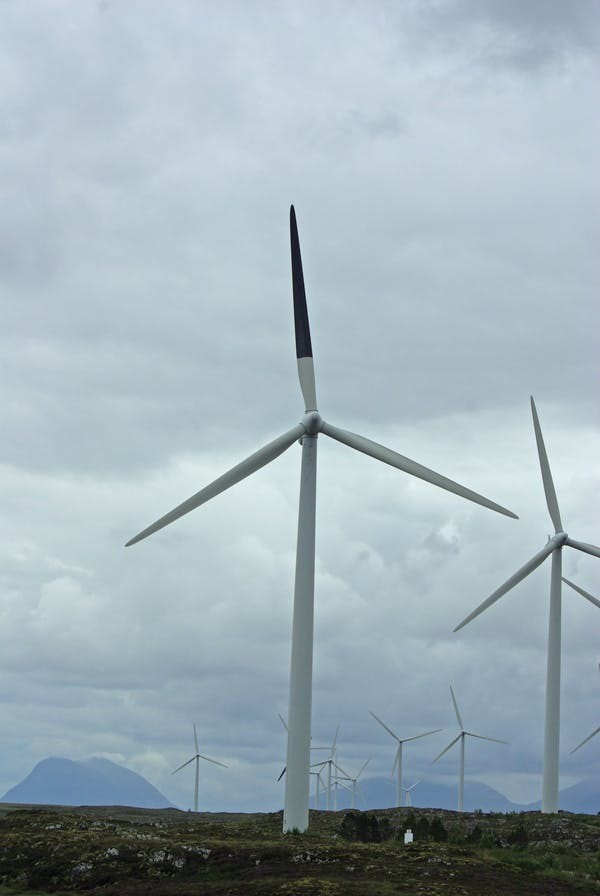
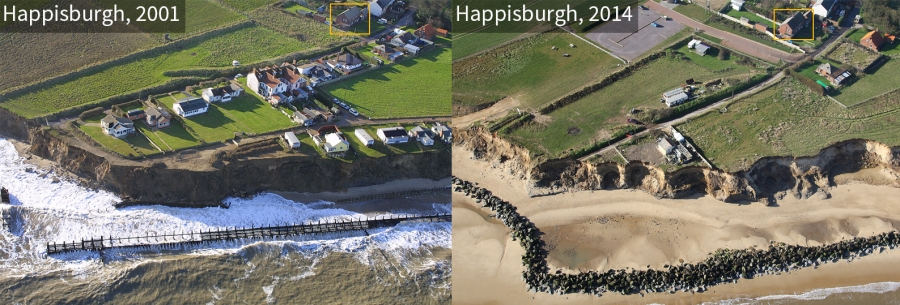
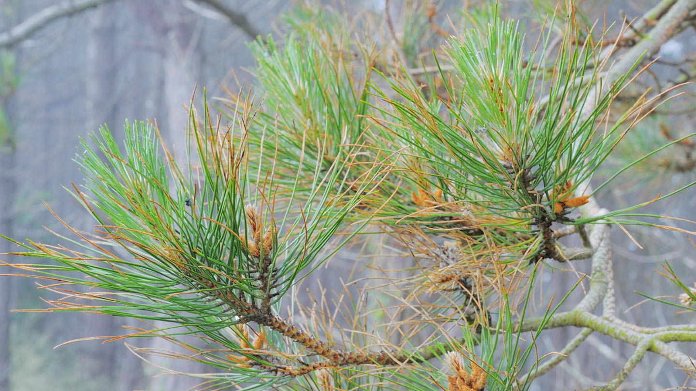
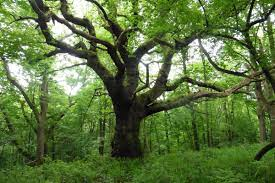
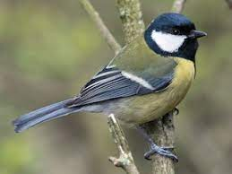
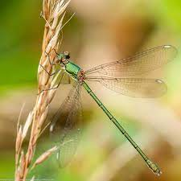

```{r setup, include=FALSE}
knitr::opts_chunk$set(echo = TRUE)

```

<https://earth.google.com/earth/d/1x9tUInzkKxO3WleaMHIMv31jXNK72c6L?usp=sharing>

## Minimising bird collisions with wind turbines

Wind power is an essential part of efforts to reduce reliance on fossil fuels to tackle climate change. However, the growth in size of wind turbines and scale of windfarms poses collision risks for birds, especially seabirds offshore and raptors on shore. It is thought that birds find it hard to see moving turbines. Researchers iat Smøla Vindkraftverk in Norway tested whether passive visual cues would make turbine motion more visible by painting one of the turbines black. They found that annual mortality was reduced by 70% compared to unpainted nearby control areas.

@may2020

Photo credits: Ian Davies




[eBird S28857002](https://ebird.org/checklist/S28857002)

[Macaulay Library ML 26861391](https://macaulaylibrary.org/photo/26861391?__hstc=60209138.8800e5de1c8e68a1ec86fa2121d42340.1680341203412.1680341203412.1680341203412.1&__hssc=60209138.1.1680341203412&__hsfp=2695420997)

------------------------------------------------------------------------

## Crumbling coastlines

Happisburgh is one of a number of places on England's North Sea coast where coastal erosion is damaging housing and infrastructure and threatening coastal villages and communities. A major contributor to erosion is storm surges when large storms and high tides combine. A recent modelling study of extreme storm surge risk and projections in the North Sea has found that climate change is increasing both mean sea level and storm intensity and is likely to generate more frequent major surges in the future.

@vousdoukas2016

Photo credits: Mike Page



.jpg)

------------------------------------------------------------------------

## Tree diseases spread as climate changes

Red-band pine needle disease is caused by a fungus called *Dothistroma septasporum* which damages the leaves and prevents photosynthesis. It has devastated Thetford Forest over the last two decades because it particularly effects Corsican pines which constitute over half of the 25,000 Ha of trees. This has necessitated mass felling and diversification of planting. Prior to the 1990s it rarely caused outbreaks in the Northern Hemisphere and French researchers have found that reduction in summer precipitation increases tree stress making them more suspectible to infection, and warming temperatures allows fungal pathogens to spread, increasing the likelihood of exposure of this and many fungal infections posing ongoing risks to UK pine forests.

@desprez-loustau2007

Photo credits: Google Images



------------------------------------------------------------------------

## Birds can synchronise nesting times with oak leafing despite climate change

Climate warming can have differential effects on the timing of seasonal natural events. Wytham Woods in Oxfordshire is the site of long term studies of the relationship between first leafing in oak trees and nesting

{width="292"}



@cole2021

## Poleward movement of dragonflies

1.  Ecological effects of climate change are not necessarily all negative. Many



[@olsen2022]

Photo credit: Dave Smallshire
